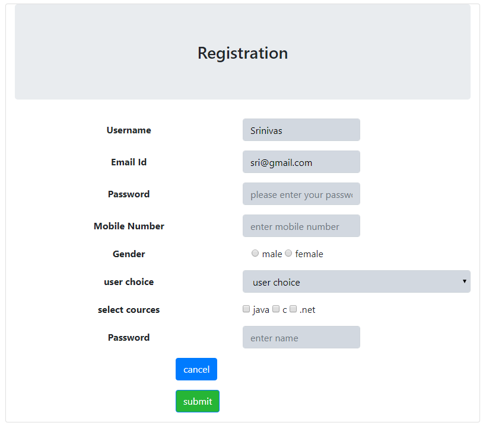

# Dynamic-Form-Creation-by-JSON is a Component developed in Angular
Dynamic-Form is a simple component used to creat a form which is designed in angular and bootstrap.

<p align="center">
    
</p>

To preview demo of Dynamic form creation by json data Component, [Click here](https://angular-amzzvc.stackblitz.io/)

## Using the complete angular component

Download the src folder in dynamic-form folder and install the required packages and run the application.

### Installing

```
> npm install
```

### Run server

```
> ng serve
```

## Adding Dynamic-form component in your project
 Download the form-generation.component from dynamic-form/src/app folder to your angular project and include required components from angular.

```html

<app-form-generator [jsonFormData]='formJson' [formGeneratorName]='formName'></app-form-generator>

```
FormName is the input to the Dynamic-Form-Creation-by-JSON of type **String**.
formJson is the input for the Dynamic-Form-Creation-by-JSON of type **FormTypes**

### FormTypes Interface

```typescript

FormTypes{
  label?:string;
  tag:string;
  value?:string;
  type?:string;
  placeholder?:string;
  values?:any;
  name?:string;
  lableStyles?:any;
  inputStyles?:any;
  buttonStyle?:any;
}
  
```

#### Interface Description
- **lable** it provides the lable for a certain element,
- **tag**   it provides the what kind tag you want to use i.e  like input,select and ect..,
- **value**  it provides the value of a particular input,
- **type**  it provides the type of the input tag for suppose text,password,mail and etc..,
- **placeholder** it provides the placeholder for an element,
- **values**  it provides array of values like radio button values and dropdown values and ect..,
- **name**  it provides the name of element,
- **lableStyles** it provides the styles for lable,
- **inputStyles**  it provides styles for the all input elements,
- **buttonStyles** it provides the styles for the buttons.

### Example JSON File
```
formJson:FormTypes[] =[
    {
      "label":"Username",
      "tag":"input",
      "type":"text",
      "placeholder":"enter name",
      value:"Srinivas",
      "lableStyles":{'font-weight':'bold'},
      "inputStyles":{'background-color':'#d2d8e0','color':'black'}
    },
    {
      "label":"Email Id",
      "tag":"input",
      "type":"email",
      "placeholder":"please enter email",
      value:"sri@gmail.com",
      "lableStyles":{'font-weight':'bold'},
      "inputStyles":{'background-color':'#d2d8e0','color':'black'}
    },
    {
      "label":"Password",
      "tag":"input",
      "type":"password",
      "placeholder":"please enter your password",
      "lableStyles":{'font-weight':'bold'},
      "inputStyles":{'background-color':'#d2d8e0','color':'black'}
    },
    {
      "label":"Mobile Number",
      "tag":"input",
      "type":"tel",
      "placeholder":"enter mobile number",
      "lableStyles":{'font-weight':'bold'},
      "inputStyles":{'background-color':'#d2d8e0','color':'black'}
    },
    {
      "label":"Gender",
      "tag":"input",
      "type":"radio",
      "name":"gender",
      "placeholder":"enter name",
      values:['male','female'],
      "lableStyles":{'font-weight':'bold'},
      "inputStyles":{'background-color':'#d2d8e0','color':'black'}
    },
    {
      tag:'select',
      values:['1','2','3','4'],
      label:'user choice',
      "lableStyles":{'font-weight':'bold'},
      "inputStyles":{'background-color':'#d2d8e0','color':'black'}
    },
    {
      tag:'input',
      type:'checkbox',
      label:'select courses',
      values:['java','c','.net'],
      "lableStyles":{'font-weight':'bold'},
      "inputStyles":{'background-color':'#d2d8e0','color':'black'}
              
    },
    {
      "value":"cancel",
      "tag":"button"
    },
    {
      "type":"submit",
      "value":"submit",
      "tag":"button",
      "buttonStyle":{'background-color':'#26b536'}
    }
  ]
}
```

## How it works
  
   User will pass the data in property binding format i.e like above mentioned tag
    then Json data object will hold this information and gives to **input decorator**
    
### @Input Decorator

     @Input() jsonFormData;
     @Input() formGeneratorName;

In dynamic form creation, we use *NgFor loop to iterate the json Data.Inside the for loop ,it checks the condition 
for the **type** based on the status we will use *ngIf to create particular form tag.

